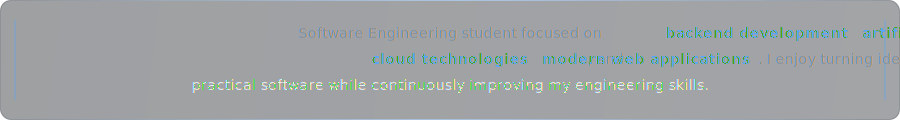

<!-- Pedro Soler — GitHub Profile -->

  

  &nbsp;&nbsp;
  &nbsp;&nbsp;
  

 

  

 

 

<h2 align="center">
  
</h2>

  <table>
    <tr>
      <td width="50%" valign="top">
        <h4 align="center">
          <a href="https://github.com/solerpedroo/projeto_integrador">2nd Place &middot; 12º Motiv.se PUC-Campinas (2025)</a>
        </h4>
        
<strong>Safe Vision</strong>

        
Awarded for a real-time computer vision safety tracking system. Recognized for the integration of YOLOv8 object detection to monitor compliance with safety standards and PPE usage in industrial environments.

      </td>
      <td width="50%" valign="top">
        <h4 align="center">
          <a href="https://github.com/solerpedroo/projeto_integrador">3rd Place &middot; 14ª Bragantec, IFSP (2024)</a>
        </h4>
        
<strong>Safe Vision</strong>

        
Recognized for the architectural design and the system's potential to reduce workplace accidents through automated visual monitoring and real-time alerting.

      </td>
    </tr>
    <tr>
      <td width="50%" valign="top">
        <h4 align="center">
          <a href="https://github.com/solerpedroo/projeto_integrador">3rd Place &middot; 12ª Mostra 3M (2024)</a>
        </h4>
        
<strong>Safe Vision</strong>

        
Evaluated on engineering rigor, system reliability, and the practical application of convolutional neural networks for real-world safety-critical systems.

      </td>
      <td width="50%" valign="top">
        <h4 align="center">
          <a href="https://github.com/solerpedroo/projeto_integrador">Semifinalist &middot; 17ª Empreenda Senac (2024)</a>
        </h4>
        
<strong>Safe Vision</strong>

        
Selected for the entrepreneurial potential and architectural scalability of the platform as a B2B safety compliance solution.

      </td>
    </tr>
    <tr>
      <td width="100%" valign="top" colspan="2">
        <h4 align="center">
          <a href="https://github.com/solerpedroo/projeto_integrador">Finalist &middot; 11ª Mostra de Ciências e Tecnologia 3M (2023)</a>
        </h4>
        
<strong>MaxWake</strong>

        
Recognized for an embedded hardware-software system designed to detect driver fatigue. Combined facial landmark analysis with sensory hardware to trigger physical warnings.

      </td>
    </tr>
  </table>

 

 

<h2 align="center">
  
</h2>

  <table>
    <tr>
      <td width="50%" valign="top">
        <h3 align="center"><a href="https://github.com/solerpedroo/driveflow">DriveFlow</a></h3>
        
<strong>Strategic & Financial Rideshare Platform</strong>

        
Comprehensive operational hub for rideshare drivers. Integrates offline-first caching, interactive map telemetry, and a contextual LLM that analyzes live driver metrics to offer actionable business recommendations.

        

        
<code>Flutter</code> <code>Dart</code> <code>Supabase</code> <code>AI Integration</code> <code>Clean Architecture</code>

      </td>
      <td width="50%" valign="top">
        <h3 align="center"><a href="https://github.com/solerpedroo/code-graph">CodeGraph</a></h3>
        
<strong>AI Code Architecture Visualizer</strong>

        
Interactive developer tool that parses and maps file-level dependency structures in large repositories. Identifies cyclic dependencies, visualizes codebase modularity via graph theory, and interfaces with AI models for structural summaries.

        

        
<code>TypeScript</code> <code>React</code> <code>Graph Theory</code> <code>Node.js</code> <code>LLM APIs</code>

      </td>
    </tr>
    <tr>
      <td width="50%" valign="top">
        <h3 align="center"><a href="https://github.com/solerpedroo/reuniai">ReuniAI</a></h3>
        
<strong>Meeting Transcription & Intelligence Hub</strong>

        
Autonomous bot integration for Google Meet, Zoom, and Teams. Manages real-time audio capturing pipelines, orchestrates speech-to-text processing via Whisper API, and applies semantic extraction via LLMs to generate executive summaries.

        

        
<code>TypeScript</code> <code>Node.js</code> <code>WebRTC</code> <code>Whisper API</code> <code>LLMOps</code>

      </td>
      <td width="50%" valign="top">
        <h3 align="center"><a href="https://github.com/solerpedroo/quantix-ai">Quantix AI</a></h3>
        
<strong>Predictive Stock & Crypto Analytics</strong>

        
High-performance financial dashboard for Brazilian stocks and cryptocurrencies. Aggregates data from multiple APIs, executes sentiment scanning, computes technical indicators, and leverages Groq LLM for automated investment recommendations.

        

        
<code>JavaScript ES6+</code> <code>Groq LLM</code> <code>Financial APIs</code> <code>HTML5/CSS3</code>

      </td>
    </tr>
    <tr>
      <td width="50%" valign="top">
        <h3 align="center"><a href="https://github.com/solerpedroo/projeto_integrador">Safe Vision</a></h3>
        
<strong>Workplace & Road Safety Computer Vision</strong>

        
Award-winning real-time safety tracking system. Processes live video streams to detect compliance with safety standards and PPE usage. Built with custom-trained YOLOv8 convolutional networks optimized for high-throughput inference.

        

        
<code>Python</code> <code>OpenCV</code> <code>YOLOv8</code> <code>CNN</code>

      </td>
      <td width="50%" valign="top">
        <h3 align="center"><a href="https://github.com/solerpedroo/codefix-ai">CodeFix AI</a></h3>
        
<strong>Self-Healing Code Quality Auditor</strong>

        
Analyzes source code for syntax anomalies, memory leaks, and style violations. Parses the AST, interfaces with Groq API for intelligent analysis, and returns side-by-side diffs showing original vs. automatically generated fix patches.

        

        
<code>JavaScript</code> <code>Node.js</code> <code>Groq API</code> <code>Highlight.js</code> <code>MySQL</code>

      </td>
    </tr>
  </table>

 

  
<strong>Additional Engineering Projects</strong>

   

  ### [GitHub Analyzer](https://github.com/solerpedroo/github-analyzer)
  Automated repository evaluation platform. Recursively parses folder structures and source code via the GitHub REST API and orchestrates LLM agents to generate comprehensive architecture documentation.
  `JavaScript` `GitHub REST API` `Groq LLM` `Node.js`

  ### [PDF Chatbot](https://github.com/solerpedroo/pdf-chatbot)
  RAG pipeline for interactive PDF querying. Extracts text, generates embeddings, stores them in ChromaDB, and performs vector similarity search to ground LLM responses within document context.
  `Python` `FastAPI` `Groq LLM` `ChromaDB` `RAG Pipeline`

  ### [Cardápio AI](https://github.com/solerpedroo/cardapio-inteligente)
  Food service automation platform. Integrates Stable Diffusion API for automated food image generation and Groq LLM for drafting commercial menu descriptions and pricing strategies.
  `JavaScript` `Node.js` `Groq API` `Stable Diffusion API` `MySQL`

  ### MaxWake
  Embedded hardware-software system to prevent accidents caused by driver fatigue. Combines Arduino and ESP32 microcontrollers with facial landmark analysis algorithms to monitor sleep patterns and trigger sensory warnings.
  `Arduino` `C++` `ESP32` `Face Analysis` `Hardware Sensors`

  ### FullControl
  Cloud automation and serverless orchestration prototype. Infrastructure-as-code routines utilizing the Serverless Framework to manage AWS Lambda functions and coordinate Dockerized microservice execution.
  `Python` `AWS Lambda` `Serverless Framework` `Docker`

 

 

<h2 align="center">
  
</h2>

  <table>
    <tr>
      <td width="33%" align="center" valign="top">
        
         
        
      </td>
      <td width="33%" align="center" valign="top">
        
         
        
      </td>
      <td width="33%" align="center" valign="top">
        
         
        
      </td>
    </tr>
  </table>

 

  

  

 

 

<h2 align="center">
  
</h2>

  <table border="0">
    <tr>
      <td align="center" valign="middle">
        
      </td>
      <td align="center" valign="middle">
        
      </td>
    </tr>
    <tr>
      <td align="center" valign="middle" colspan="2">
         
        
      </td>
    </tr>
    <tr>
      <td align="center" valign="middle" colspan="2">
         
        
      </td>
    </tr>
  </table>

 

  <picture>
    <source media="(prefers-color-scheme: dark)" srcset="https://raw.githubusercontent.com/solerpedroo/solerpedroo/output/snake-dark.svg">
    <source media="(prefers-color-scheme: light)" srcset="https://raw.githubusercontent.com/solerpedroo/solerpedroo/output/snake.svg">
    
  </picture>

 

  

  <a href="https://www.linkedin.com/in/pedro-henrique-contardi-soler/">LinkedIn</a> &middot;
  <a href="mailto:pedrocsoler@hotmail.com">pedrocsoler@hotmail.com</a> &middot;
  <a href="https://solerpedroo.github.io/portfolio-pedro/">Portfolio</a>

